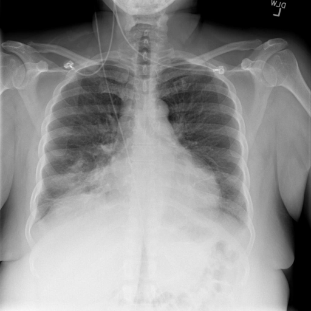
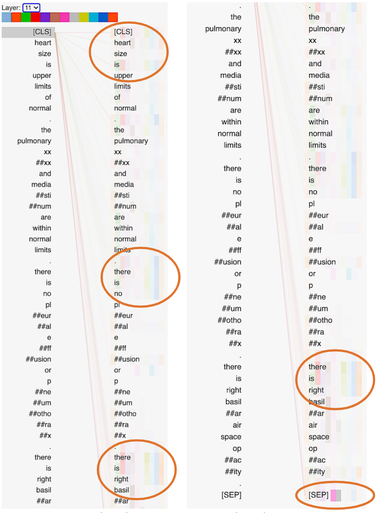
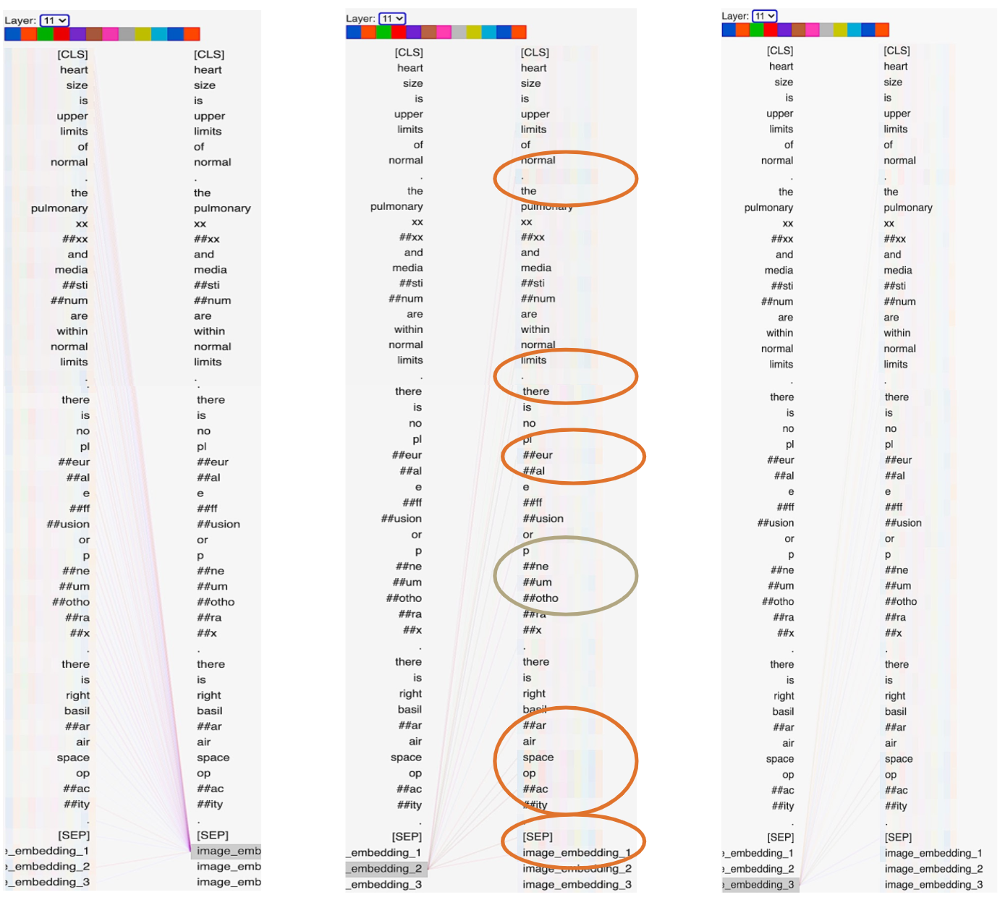

# Pre-Trained Multi-Modal Text and Image Classification in Sparse Medical Data Application

This work is part of the Software Project: "Language, Action and Perception" at Saarland Universitz, WS 2020-2021.

This repository contains our implementation and a summary of our research findings.

# Contents

* [Directory Organization](#this-directory-file-organization)
* [Project Overview](#overview)
* [MMBT Model](#supervised-multimodal-bitransformers-for-classifying-images-and-text-mmbt)
* [Dataset](#dataset)
* [Requirements](#requirements)
* [Instructions](#instructions)
* [Notebooks](#notebooks)
* [Preprocess](#preprocess)
* [Experiments](#experiments)
* [Results](#results)
* [References](#references)

## This Directory File Organization

This project repository is organized as follows:

* **Pre-Trained Multi-Modal Text and Image Classifier in Sparse Data Application**: the parent project directory
    * this README.md file
    * **data/**: contains data files subdirectories and data preparation scripts
        * **json/**
        * **csv/**
        * **image_labels_csv/**
        * **models/**
        * **NLCXR_front_png/**
        * preparations.py
    * **MMBT/**: contains MMBT model src codes and related utility functions
        * image.py
        * mmbt.py
        * mmbt_config.py
        * mmbt_utils.py
    * **runs/**: saved Tensorboards for displaying models' performance
    * **integrated_gradients/**:
        * **examples/**
        * **figures/**
        * **results/**
        * integrated_gradients.py
        * main.py
        * utils.py
        * visualization.py
    * *run_mmbt.ipynb* notebook
    * *run_bert_text_only.ipynb* notebook
    * *run_mmbt_masked_text_eval.ipynb* notebook  
    * *image_submodel.ipynb* notebook
    * *bertviz_attention.ipynb* notebook
    * *false_preds.ipynb* notebook  
    * *baseline_experiments_results.ipynb* notebook
    * textBert_utils.py src codes and utility functions for the *run_bert_text_only.ipynb* notebook
    
*Note:* The NLCXR_front_png directory is NOT provided; please make this directory after cloning the repo and obtain the
image files according to the instruction in the **/data** directory.  

*Note2:* Previous run's outputs and checkpoints are omitted due to large file size. When new experiments are run, the notebooks
will make a new directory in this parent directory. the **runs/** directory will also be updated during each experiment (text-only
and MMBT).

[Back to Contents](#contents)

## Overview

This repo presents our multimodal model, its submodules, and the experiments we performed to answer our research 
questions. Our main focus of the project is to try to answer the following questions:

* Can multimodal  embeddings  improve  transfer learning performance in  low-data  classification  tasks over 
  unimodal embeddings?
* Related works show improvements in classification and similarity tasks when combining visual and text modalities. 
  Does this effect carry over to the medical domain?   
* How does the multimodal representation contribute to the improved performance?
* How do different approaches to combining modalities affect performance?
    * Specifically, does having a more integrated fusion approach between the text and visual modalities perform 
      better in downstream tasks than simply concatenating vectors representing the two modalities?

The experiments we ran on the model are as follows:

1. Image-only classification
2. Text-only classification
3. Multimodal classification: text and image inputs
4. Attention mechanism visualization
5. Image-only classification with the multimodal model trained on text and image data
   
In addition, we also present the *Integrated Gradient* to visualize and extract explanations from the images.

### Notes on Implementation

* We implemented our models in PyTorch and used Huggingface `BERT-base-uncased` model in all our BERT-based models.

* For training the MMBT model, we used the default settings for hyperparameters as in the original
  [Huggingface Implementation](https://github.com/huggingface/transformers/blob/master/examples/research_projects/mm-imdb/run_mmimdb.py)

* For training the text-only model, we used the default settings for hyperparameters as in 
  [Huggingace Example](https://github.com/huggingface/transformers/blob/master/examples/text-classification/run_glue_no_trainer.py)  
  
* We trained with the batch size of 32 and in some cases where memory is insufficient, 16, for the MMBT and text-only
model.  

* We extended our training for the MMBT model to 10.0 epochs instead of the default = 3.0 in Huggingface. 
  We noticed that MMBT model's validation starts to worsen (overfit) only after 6 epochs.
  
* We trained the text only model to 4.0 epochs as recommended in the BERT paper by Devlin et al. (2019).

* We followed the default hyparameter settings for DenseNet in fine-tuning the image-only model.

[Back to Contents](#contents)

### Supervised Multimodal BiTransformers for Classifying Images and Text (MMBT)

In our project, we are experimenting with the Supervised Multimodal BiTransformers for Classifying Images and Text
(MMBT) presented by Kiela et al. (2020). This is a BERT-based model that can accommodate multi-modal inputs.
The model aims to fuse the multiple modalities as the input data are introduced to the Transformers
architecture so that the model's attention mechanism can be applied to the multimodal inputs. For more information
regarding the model, please refer to the documentation in the **MMBT** directory.

[Back to Contents](#contents)

### Dataset

For more information regarding the dataset utilized in the project and the
preparation steps, please consult the information in the **data** directory.

Before proceeding to train and test the model, the frontal X-ray image files used in the
experiments can be obtained via the link to this [Shared Google Drive](https://drive.google.com/drive/folders/1d_Axy6ePY-ETJLIns67PDk1NvDyrgsMj?usp=sharing).

For access to all X-ray images, include non-frontal images, please refer to
this [Other Shared Google Drive](https://drive.google.com/drive/folders/1OP6aPLMF4ib2kTCTp9YeG0b6zVVorfKW?usp=sharing).

The frontal images should be saved to the **data/NLMCXR_png_frontal** subdirectory inside
the **./data/** directory.

The X-ray images from the other shared Google Drive should be saved to the **data/NLMCXR_png** subdirectory inside
the **./data/** directory.

Please note that these 2 subdirectories are **NOT** included in this repo and will need
to be created as part of the preparation steps to reproduce the experiments.

For reference, here's also a link to the original dataset of the 
[Indiana University Chest X-ray](https://openi.nlm.nih.gov/detailedresult?img=CXR111_IM-0076-1001&req=4).

[Back to Contents](#contents)

### Requirements

* The project scripts were tested on Python 3.6 and 3.7. on Mac OS and Linux.
* We tested in Anaconda python virtual environment.
* Notebooks were tested on Google Colab and experiments were run on Google Colab when GPU is required.
* GPU is recommended to run the experiment. A single GPU is sufficient.
    * the MMBT experiments will run out of standard CPU memory in Google Colab unless GPU is available.
    * to run multiple experiments, it may be necessary to reset the runtime from time to time.
* Approximate runtime/experiment: 5-30 minutes.

[Back to Contents](#contents)

### Instructions

1. Please create a virtual environment with the provided .yml file `LAP_environment.yml`   
   1.1 This `.yml` file was created on and for a Mac OS platform. If you are running a different system, this option
   may not work.  
   1.2 see [Alternative Instructions](#alternative-instructions) for replicating this project via Google Colab
2. Clone this repository
3. Download image files according to the instructions in the *Dataset* section.
4. The notebooks can be run in any order, with the following exceptions:  
   
   4.1 The `baseline_experiments_results.ipynb` notebook will only reflect new runs if you run it afterward. 
   You can view previously executed runs in that notebook, however.  
   
   4.2 The `run_mmbt_masked_text_eval.ipynb` and `bertviz_attention.ipynb` notebooks runs on previously saved model(s); 
   so you need to have trained and saved a model (MMBT and/or the BERT text-only) in the output directory specified in 
   the `--output_dir` argument to successfully run this notebook.  
        4.2.1 the `--output_dir` arguments in these notebooks need to be the output directory where the model is saved;
        The easiest way to follow this is to make sure that the `--output_dir` argument for these notebooks are the 
        same as the `--output_dir` argument in either the `run_mmbt.ipynb` or `run_bert_text_only.ipynb` notebooks.
   
5. To change hyperparameters for the text-only and MMBT notebooks, simply change the default values in the cell
containing the Argument parser.  
   
    5.1 These notebooks can simply be run as is according to the default arguments.  
    5.2 To specify the experiment to be run, simply change the filenames of the desired datafile and specify the output
   directory, otherwise results will simply be written over the existing output directory.
   
6. The loaded Tensorboard in the **baseline_experiments_results.ipynb** can be re-launched to reflect new
experiment results.
   

#### Alternative Instructions

We have created a [shared Google Drive - LAP](https://drive.google.com/drive/folders/1gwgx4ZApTKz5fN6SG9YkiVjVCZ0WNGeH?usp=sharing) 
for this project where all the scripts, data, and Jupyter/Colab Notebooks in this repo have been uploaded. 
Simply download this drive and re-upload to your own Google Drive for testing. (i.e. you can only _view_ files
in this Drive and comment, but you cannot edit them.)

**IMPORTANT:** If you choose to test our project this way, please be aware that you still **need** to update the 
path to the 'LAP' directory to reflect its location in your 'MyDrive'. Your `pwd` should always be the 'LAP'
project parent directory for the codes to work as intended. (The name for this directory needs not be 'LAP', but has
to be at the same level as described in the [Directory Organization](#this-directory-file-organization).)

**Caveats:** We reserve the ability to modify this Drive from time to time; particularly to manage storage. 
We may delete or write over files in this shared Drive without notice and access is only provided for your convenience.
There may be log files from our experiments and previously run model weights; however those are not necessary for 
project reproducibility.

### Notebooks

The notebooks in this directory contain the code to run the experiments. Please see each individual notebook for
more detailed explanations. Using Google Colab is recommended since they were created and tested on Colab and running the models without GPU can take a long time. 
If you have access to a GPU outside of Colab, it is possible of course to run the experiments on an environment of your choice but the notebooks cannot be guaranteed 
to work on every possible setting.

* **baseline_experiments_results.ipynb** shows the Tensorboard from the experiments with the textonly BERT
model and the MMBT model
  

* **run_bert_text_only.ipynb** shows the end-to-end pipeline for running the text-only experiments

* **run_mmbt.ipynb** notebook shows the end-to-end MMBT experiment pipeline

* **bertviz_attention.ipynb** shows the steps to visualize the attention mechanism using BertViz (Vig, 2019)

* **run_mmbt_masked_text_eval.ipynb** shows the steps to test the MMBT model with masked text input for unimodal
image classification
  
* **image_submodel.ipynb** This notebook details the Image-only model and how we obtained our results from that experiment.

### Preprocess

You can basically ignore the **preprocess/ folder**, since it's not relevant for running the any parts of the model. 
It includes various scripts that were used in extracting the labels from the dataset, checking that the created files 
match with the content of the reports and images they were created from and also filtering the frontal images from the 
rest.  

[Back to Contents](#contents)
## Experiments

### Multimodal Contribution

These are experiments 1-3 listed in the [Overview](#overview) Section.

### Attention Mechanism Visualization

#### Multimodal Corrections

Although our Text-only model seems to perform slightly better than our multimodal model we were still curious to see
if there exist some edge cases where the model actually benefits from multimodality. Indeed, we did find some of these
edge cases where the text model does make a false predictions but MMBT predicts it correctly. The opposite is naturally
true as well. There does exist other cases where MMBT makes a mistake and the text-model does not.
This naturally follows from the fact that the text model achieves a higher accuracy.
However, for this specific experiment we were more interested in the former case, where the model does benefit from
multimodality in terms of making correct predictions. The results of this can be seen in the table below.

| Labeling Scheme   | Total Errors (Text Model) | Total Corrected by MMBT | Corrected False Positives | Corrected False Negatives|
|-------------------|---------------------------|-------------------------|---------------------------|--------------------------|
| Major             | 17                        | 3                       | 0                         | 3                        |
| Impression        | 70                        | 31                      | 12                        | 19                       |

We were curious to further investigate these cases where the text model makes a mistake and the multimodal model
corrects it. Therefore, we decided to visualize the attention weights of some of these cases using the BertViz
visualization tool by Jesse Vig (2019). We compared the attention weights of the text-only model to the attention
weights of our multimodal model (MMBT) to see whether there are any visible differences between these cases.
In the multimodal model, the image embeddings are projected into BERT's text token space and they are propagated
through the self-attention layers, just like the normal text embeddings. This allows us to look at the attention
weights of these image embeddings and see whether they attend more or less to other tokens and whether these
connections can reveal anything about what leads the multimodal model to correct some of these cases where the
text model fails.

In addition, visualizing attention weights can help reveal whether there are any general patterns that explain how
the attention mechanism contributes to making predictions.

This constitutes experiment 4 in the [Overview](#overview) Section.

### Image Classification from Multimodal Fine-Tuning

One additional experiment we conducted was to use our multimodal model on unseen unimodal images. Since our image model
is the weak link in our multimodal setting, with clearly the lowest accuracy, we were curious to see whether using
our finetuned multimodal model in a scenario where we mask all the text input and rely solely on the image modality
would lead to a better performance than our image only model achieves.

This is experiment 5 in the [Overview](#overview) Section.

### Integrated Gradients

The integrated gradients is a way to visualize and extract explanations from the images. The basic idea behind it is that we can make use of the learned weights,
which allow us to take the partial derivatives w/ respect to the inputs (the pixels) and visualize gradients that have highest activations with respect to some threshold value.
The integrated gradients module is a fork from this repository <https://github.com/TianhongDai/integrated-gradient-pytorch> and it comes with an open source MIT license.
We have slightly modified the original implementation to work with our data. For more information consult the original paper ["Axiomatic Attribution for Deep Networks"](https://arxiv.org/pdf/1703.01365.pdf).
Also consult the **image_submodel.ipynb** notebook for more details on how it was used in our experiment.

Otherwise, the **integrated_gradients/** directory itself can be safely ignored in terms of running the experiments.

[Back to Contents](#contents)

## Results

We evaluated our model on 2 different labeling schemes. In our main labeling scheme we extracted the labels from the 
_'major'_ field in the radiologists report. We labeled everything tagged as **'normal'** as **0** and everything else 
as  **'abnormal'** or **1**. This led to approximately **40%** normal cases and **60%** abnormal cases. 

In addition, we experimented using the _'impression'_ field in the radiologists report as the basis for our labels, 
as this is likely what a medical professional would look at in determining the significance of the report.  
This led to approximately **60%** normal cases and **40%** abnormal cases, the exact opposite of our main labeling scheme.  
We used the text from the 'findings' field in the radiologists report as our text modality for all of our experiments. 
We then evaluated our models on both of these labeling schemes. 

The results can be seen in the table below.

#### Findings: Unimodal vs. Multimodal models

| Model       | MMBT (major) | MMBT (impression) | Masked Text MMBT (major)  |Masked Text MMBT (impression)|
|-------------|--------------|-------------------|---------------------------|-----------------------------|
| Multimodal  | 0.96         | 0.86              |0.66                       |0.77                         |
| Text-only   | **0.97**     | **0.88**          |N/A                        |N/A                          |
| Image-only  | 0.74         | 0.74              |N/A                        |N/A                          |

In addition, we tried a third multilabel labeling scheme, which was based on the _'major'_ labels. 
However, we created a third category for cases that were borderline abnormal and did not involve any kinds of diseases, 
but other abnormalities, such as medical instruments or devices. We report our multilabel results in F1 instead of 
accuracy. The results can be seen in the table below.

#### Findings: Binary vs. Multilabel

| Model        | MMBT - Binary (accuracy) | MMBT - Multilabel (macro/micro F1) |Masked Text MMBT - Binary (accuracy)|MMBT - Multilabel (macro/micro F1) |
|--------------|--------------------------|------------------------------------|------------------------------------|-----------------------------------|
| Multimodal   | 0.96                     | 0.82/0.93                          |0.66                                |0.41/0.55                          |
| Text-only    | 0.97                     | 0.86/0.94                          |N/A                                 |N/A                                |    
| Image-only   | 0.74                     | N/A                                |N/A                                 |N/A                                |

#### Findings: Attention Mechanism Visualization

From the results table in [Multimodal Corrections](#multimodal-corrections), it is apparent that there are cases where the text-only
model makes false predictions when the MMBT model does not. We selected an example to visualize the attention heads for
comparison between the text-only and the MMBT model.

**Sample ID:** CXR2363 

|Image|Text|Impression|Major|Labeling
|---|---|---|---|---|
|| Heart size is upper limits of normal.The pulmonary XXXX and mediastinum are within normal limits. There is no pleural effusion or pneumothorax.There is right basilar air space opacity.| Right middle lobe and lower lobe pneumonia. Followup radiographs in 8-12 weeks after appropriate therapy are indicated to exclude an underlying abnormality.|Opacity/lung/base/right Pneumonia/middle lobe/right Pneumonia/lower lobe/right| 1 = abnormal|

##### Text-Only Model Attention
The last layer’s attention head of the text-only model, which falsely predicts the label for this sample. 
The lines show the attention scores corresponding to the text tokens with line intensity being proportional to 
attention weight. Tokens with higher attention scores are circled.

##### MMBT Model Attention
The last layer’s attention head of the MMBT model, which correctly predicts the label for this sample. 
_left figure_ = _image embedding token 1_,_center_ = _image embedding token 2_, _right_ = _imageembedding token 3_. 
Tokens with higher attention scores are circled.

As  can  be  examined  in  the images above,  the MMBT model’s attention mechanism aligns the second image embedding 
token to content word tokens such as _‘pleural’_, _‘pneumothorax’_, _‘basilar’_, _‘air’_, 
_‘space’_, and _‘opacity’_ in addition to the _‘[SEP]’_ and first image embedding token. 
In contrast, the attention mechanism in the text-only model aligns the _‘[CLS]’_ token more strongly 
(higher attention scores) with the following tokens: _‘heart’_, _‘is’_, _‘there’_, _‘no’_, _‘.’_, and
_‘right’_.

#### Findings: Image Classification from Multimodal Fine-Tuning

Results from this experiment are reported in the **Masked Text** columns of the tables in 
[Findings: Unimodal vs Multimodal](#findings-unimodal-vs-multimodal-models) and 
[Findings:Findings: Binary vs. Multilabel](#findings-binary-vs-multilabel).

MMBT's improvement over the unimodal image-only model in this scenario is only observed when tested on the 
_'impression'_ labeled dataset. 

[Back to Contents](#contents)

## References

Faik Aydin, Maggie Zhang, Michelle Ananda-Rajah, and Gholamreza Haffari. 2019. Medical Multimodal Classifiers Under Scarce
Data Condition. [arXiv:1902.08888.](https://arxiv.org/abs/1902.08888)

Guillem Collell, Ted Zhang, and Marie-Francine Moens. 2017. Imagined visual representations as multimodal embeddings. In
Proceedings of the Thirty-First AAAI Conference on Artificial Intelligence, AAAI’17, pages 4378–4384, San Francisco, California,
USA. AAAI Press.[AAAI Press](https://aaai.org/ocs/index.php/AAAI/AAAI17/paper/view/14811)

Dina Demner-Fushman, Marc D. Kohli, Marc B. Rosenman, Sonya E. Shooshan, Laritza Rodriguez, Sameer Antani, George R.
Thoma, and Clement J. McDonald. 2016. Preparing a collection of radiology examinations for distribution and retrieval. Journal of
the American Medical Informatics Association : JAMIA, 23(2):304–310.
[DOI: 10.1093/jamia/ocv080](https://academic.oup.com/jamia/article/23/2/304/2572395)

Jacob Devlin, Ming-Wei Chang, Kenton Lee, and Kristina Toutanova. 2019. BERT: Pre-training of Deep Bidirectional Transformers
for Language Understanding. [arXiv:1810.04805.](https://arxiv.org/abs/1810.04805)

Allyson Ettinger. 2020. What BERT Is Not: Lessons from a New Suite of Psycholinguistic Diagnostics for Language Models.
Transactions of the Association for Computational Linguistics, 8:34–48.
[arXiv:1907.13528](https://arxiv.org/abs/1907.13528)

Kaiming He, Xiangyu Zhang, Shaoqing Ren, and Jian Sun. 2015. Deep Residual Learning for Image Recognition. 
[arXiv:1512.03385.](https://arxiv.org/abs/1512.03385)

Douwe Kiela, Suvrat Bhooshan, Hamed Firooz, Ethan Perez, and Davide Testuggine. 2020. Supervised Multimodal
Bitransformers for Classifying Images and Text. [arXiv:1909.02950.](https://arxiv.org/abs/1909.02950)

Yoon Kim. 2014. Convolutional Neural Networks for Sentence Classification. [arXiv:1408.5882.](https://arxiv.org/abs/1408.5882)

Olga Kovaleva, Alexey Romanov, Anna Rogers, and Anna Rumshisky. 2019. Revealing the Dark Secrets of BERT. In Proceedings of
the 2019 Conference on Empirical Methods in Natural Language Processing and the 9th International Joint Conference on
Natural Language Processing (EMNLP-IJCNLP), pages 4365–4374, Hong Kong, China. Association for Computational Linguistics.
[arXiv:1908.08593](https://arxiv.org/abs/1908.08593)

Jiasen Lu, Dhruv Batra, Devi Parikh, and Stefan Lee. 2019. ViLBERT: Pretraining Task-Agnostic Visiolinguistic Representations for
Vision-and-Language Tasks. [arXiv:1908.02265.](https://arxiv.org/abs/1908.02265)

Pranav Rajpurkar, Jeremy Irvin, Kaylie Zhu, Brandon Yang, Hershel Mehta, Tony Duan, Daisy Ding, Aarti Bagul, Curtis Langlotz,
Katie Shpanskaya, Matthew P. Lungren, and Andrew Y. Ng. 2017. CheXNet: Radiologist-Level Pneumonia Detection on Chest
X-Rays with Deep Learning. [arXiv:1711.05225.](https://arxiv.org/abs/1711.05225)

Claudia Schulz and Damir Juric. 2020. Can Embeddings Adequately Represent Medical Terminology? New Large-Scale Medical
Term Similarity Datasets Have the Answer! Proceedings of the AAAI Conference on Artificial Intelligence, 34(05):8775–8782.
[arXiv:2003.11082](https://arxiv.org/abs/2003.11082)

Francesca Strik Lievers and Bodo Winter. 2018. Sensory language across lexical categories. Lingua, 204:45–61.
[https://doi.org/10.1016/j.lingua.2017.11.002](https://doi.org/10.1016/j.lingua.2017.11.002)

Mukund Sundararajan,  Ankur Taly, Qiqi Yan. 2017. Axiomatic Attribution for Deep Networks.
[ArXiv:1703.01365.](https://arxiv.org/pdf/1703.01365.pdf)

Hao Tan and Mohit Bansal. 2019. LXMERT: Learning Cross-Modality Encoder Representations from Transformers.
[arXiv:1908.07490.](https://arxiv.org/pdf/1908.07490.pdf)

Jesse Vig. 2019. A Multiscale Visualization of Attention in the Transformer Model. In Proceedings of the 57th Annual Meeting of
the Association for Computational Linguistics: System Demonstrations, pages 37–42, Florence, Italy. Association for
Computational Linguistics.
[arXiv:1906.05714](https://arxiv.org/abs/1906.05714);
[BertViz GitHub](https://github.com/jessevig/bertviz)

Xiaosong Wang, Yifan Peng, Le Lu, Zhiyong Lu, Mohammadhadi Bagheri, and Ronald M. Summers. 2017. ChestX-ray8:
Hospital-scale Chest X-ray Database and Benchmarks on Weakly-Supervised Classification and Localization of Common Thorax
Diseases. 2017 IEEE Conference on Computer Vision and Pattern Recognition (CVPR), pages 3462–3471.
[arXiv:1705.02315](https://arxiv.org/abs/1705.02315)

[Back to Contents](#contents)